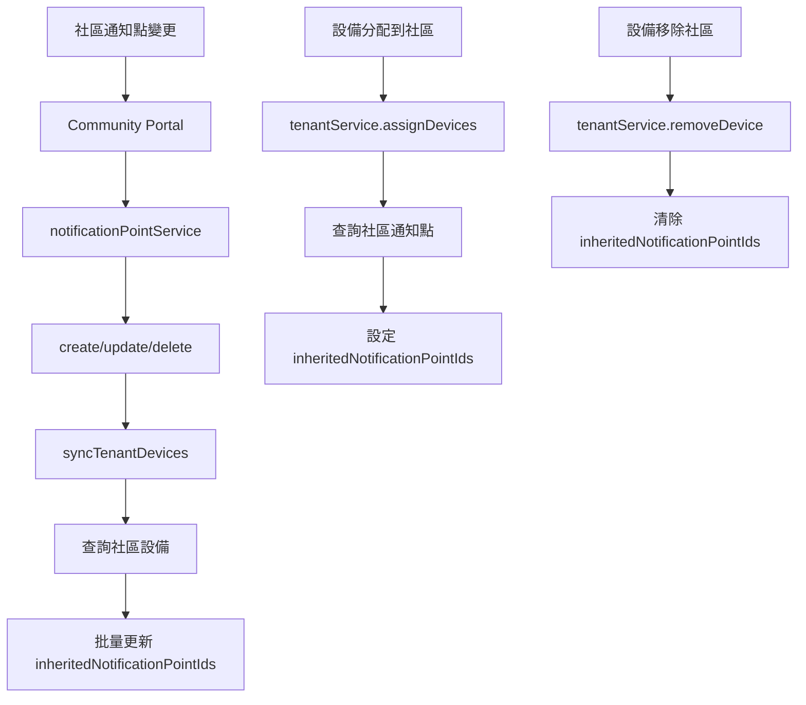

# 通知點實時同步機制使用指南

## 概述

統一通知架構已實現**實時同步機制**，確保設備的 `inheritedNotificationPointIds` 始終與社區的通知點保持一致。

## 自動同步觸發時機

### 1. 社區通知點變更時（Community Portal）

| 操作 | 觸發時機 | 同步範圍 |
|------|---------|---------|
| **新增通知點** | 通知點創建後 | 該社區的所有設備 |
| **更新通知點** | 通知點更新後 | 該社區的所有設備 |
| **刪除通知點** | 通知點刪除後 | 該社區的所有設備 |

#### 範例

```typescript
// Community Portal: 新增通知點
await notificationPointService.create({
  tenantId: 'tenant_001',
  gatewayId: 'gateway_123',
  name: '社區大門',
  isActive: true,
});

// 自動觸發：
// → 查詢 tenant_001 的所有設備
// → 更新每個設備的 inheritedNotificationPointIds
```

### 2. 設備分配/移除時（Admin Portal 或 Community Portal）

| 操作 | 觸發時機 | 結果 |
|------|---------|------|
| **分配設備到社區** | 設備分配時 | 設備立即獲得該社區的通知點 |
| **移除設備** | 設備移除時 | 清除設備的 inheritedNotificationPointIds |

#### 範例

```typescript
// 分配設備到社區
await tenantService.assignDevices('tenant_001', ['device_123']);

// 結果：
// devices/device_123
// {
//   tags: ['tenant_001'],
//   inheritedNotificationPointIds: ['gateway_001', 'gateway_002']
// }
```

## 手動同步工具

### 使用場景

1. 首次部署新架構後
2. 資料不一致時
3. 定期維護

### 同步所有社區

```bash
cd functions
npx ts-node src/utils/syncTenantNotificationPoints.ts
```

輸出範例：
```
========================================
開始同步所有社區的通知點到設備
========================================

找到 5 個啟用的社區

[tenant_001] 開始同步社區通知點...
[tenant_001] 社區名稱: 大愛社區
[tenant_001] 找到 3 個啟用的通知點: gateway_001, gateway_002, gateway_003
[tenant_001] 找到 25 個設備
[tenant_001] 更新設備 device_001: 0 → 3 個通知點
[tenant_001] 更新設備 device_002: 0 → 3 個通知點
...
[tenant_001] ✅ 成功更新 25 個設備

========================================
同步完成
========================================

總計：
  - 處理社區: 5
  - 有通知點的社區: 3
  - 更新設備: 87

詳細結果：
  大愛社區: 25 設備, 3 通知點
  幸福社區: 32 設備, 2 通知點
  快樂社區: 30 設備, 4 通知點

========================================
```

### 同步單一社區

```bash
cd functions
npx ts-node src/utils/syncTenantNotificationPoints.ts tenant_dalove_001
```

## 資料流程圖



## 實作細節

### Community Portal

**檔案：** `community-portal/src/services/notificationPointService.ts`

新增方法：
- `syncTenantDevices(tenantId: string)` - 同步社區設備

修改方法：
- `create()` - 創建後自動同步
- `update()` - 更新後自動同步
- `delete()` - 刪除後自動同步

### Admin Portal

**檔案：** `src/services/tenantService.ts`

修改方法：
- `assignDevices()` - 分配時設定通知點
- `removeDevice()` - 移除時清除通知點

### 手動同步工具

**檔案：** `functions/src/utils/syncTenantNotificationPoints.ts`

提供函數：
- `syncSingleTenant(tenantId)` - 同步單一社區
- `syncAllTenants()` - 同步所有社區

## 驗證同步結果

### 1. Firestore Console 檢查

```
devices/{deviceId}
{
  tags: ["tenant_001"],
  inheritedNotificationPointIds: ["gateway_001", "gateway_002"],
  bindingType: "ELDER",  // 或 "MAP_USER" 或 "UNBOUND"
}
```

### 2. 檢查 Cloud Functions 日誌

```bash
firebase functions:log --only syncTenantDevices
```

關注訊息：
- `Syncing notification points for tenant {tenantId}`
- `Found X active notification points for tenant {tenantId}`
- `Found X devices in tenant {tenantId}`
- `Successfully synced X devices with X notification points`

### 3. 測試通知發送

1. 設備經過通知點 gateway
2. 檢查是否觸發通知
3. 查看 `receiveBeaconData` 日誌確認使用了 `inheritedNotificationPointIds`

## 常見問題

### Q: 設備沒有 inheritedNotificationPointIds？

**可能原因：**
1. 社區沒有設定通知點
2. 社區的通知點都是 `isActive: false`
3. 設備分配到社區時尚未實施自動同步

**解決方法：**
```bash
# 執行手動同步
cd functions
npx ts-node src/utils/syncTenantNotificationPoints.ts tenant_xxx
```

### Q: 新增通知點後，設備沒有立即更新？

**檢查步驟：**
1. 確認通知點 `isActive: true`
2. 檢查 Cloud Functions 日誌是否有錯誤
3. 確認設備的 `tags` 包含該社區 ID

**手動觸發：**
```bash
npx ts-node src/utils/syncTenantNotificationPoints.ts tenant_xxx
```

### Q: 刪除通知點後，設備還有舊的 gatewayId？

**正常行為：**
刪除通知點會觸發同步，設備的 `inheritedNotificationPointIds` 應該會移除該 gatewayId。

**如果沒有移除：**
1. 檢查是否有多個同樣的 gatewayId（不同的通知點文件）
2. 執行手動同步

### Q: 同步會影響效能嗎？

**效能影響：**
- 每次通知點變更會觸發一次批量更新
- 使用 Firestore batch 操作，效能良好
- 對於大型社區（100+ 設備），可能需要 1-2 秒

**優化建議：**
- 批量新增/刪除通知點時，可先停用自動同步
- 完成後手動執行一次同步

## 最佳實踐

### 1. 設定通知點的順序

✅ **推薦順序：**
1. 先為社區設定通知點
2. 再分配設備到社區
3. 最後綁定設備給長輩

### 2. 修改通知點時

- 直接在 Community Portal 新增/編輯/刪除
- 系統會自動同步到所有設備
- 無需手動操作

### 3. 定期維護

建議每月執行一次手動同步，確保資料一致性：
```bash
cd functions
npx ts-node src/utils/syncTenantNotificationPoints.ts
```

## 部署後步驟

1. **部署新程式碼**
   ```bash
   cd functions
   npm run build
   firebase deploy --only functions
   
   cd ../community-portal
   npm run build
   firebase deploy --only hosting
   ```

2. **執行一次性同步**
   ```bash
   cd functions
   npx ts-node src/utils/syncTenantNotificationPoints.ts
   ```

3. **驗證結果**
   - 在 Firestore Console 檢查幾個設備
   - 測試新增/刪除通知點是否自動同步
   - 測試通知發送是否正常

## 總結

✅ **實現的功能：**
- 新增通知點 → 自動同步到設備
- 更新通知點 → 自動同步到設備
- 刪除通知點 → 自動同步到設備
- 分配設備 → 立即獲得通知點
- 移除設備 → 清除通知點

✅ **優點：**
- 資料即時一致
- 無需手動維護
- 自動化程度高
- 支援手動修復

您的需求已完全實現！🎉
